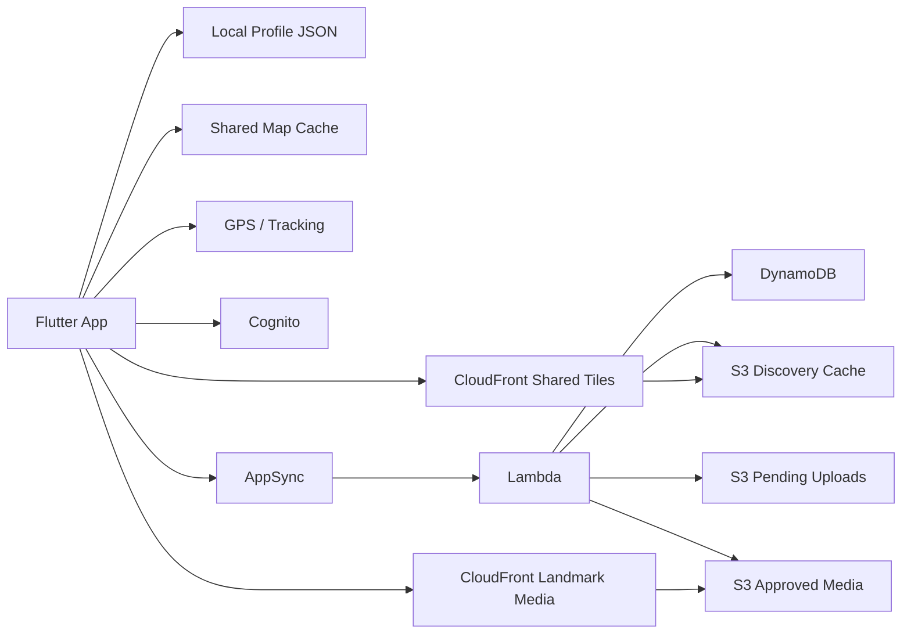

# Mist of Atlas: World of Fog

The product/app is **Mist of Atlas: World of Fog**. `FogMap`, `fog_frontier`, and `world_of_fog` are internal repository, Dart package, and binary identifiers rather than public product names.

Mist of Atlas: World of Fog is a local-first exploration app with an optional shared realm.

The product has two distinct responsibilities:

- personal atlas: record where a player has actually been and render that history as fog-of-war map reveal
- shared realm: show other active players, approved landmarks, and globally shared discovery without making the app depend on the backend for its core personal value

This repository contains both the Flutter app and the Terraform-managed AWS backend.

## What The System Is Optimized For

The system is designed around a few non-negotiable rules:

- personal progress must remain usable offline
- the app must still work without the shared backend
- AWS should be the source of truth for cloud/shared state, not the phone
- repeated shared-map reads should be cheap
- live presence should disappear quickly when the app closes
- landmark uploads must be moderated before public display

## High-Level Architecture

At a high level, the project is split into:

- Flutter client in `lib/`
- AWS infrastructure in `Terraform/`
- focused architecture notes in `docs/`

Runtime shape:

```text
Phone
  -> local profile JSON + local shared-map cache
  -> GPS tracking + fog rendering
  -> Cognito auth
  -> AppSync for mutations, auth-sensitive queries, and live presence
  -> S3/CloudFront for approved landmark media
  -> S3/CloudFront-backed shared tile delivery when configured

AWS
  -> Cognito user pool for identity
  -> AppSync GraphQL API as the application API surface
  -> Lambda for domain logic
  -> DynamoDB for write truth
  -> S3 for upload staging, approved media, and cached tile/bootstrap snapshots
  -> CloudFront for approved landmark delivery and shared tile delivery
```

Architecture view:



## Repository Layout

### Flutter App

Important client files:

- `lib/main.dart`: creates the service graph and the root `AppController`
- `lib/app.dart`: root app widget and bootstrap gate
- `lib/controllers/app_controller.dart`: central orchestration for auth, tracking, cloud sync, map mode, shared cache, and landmarks
- `lib/services/location_service.dart`: permission enforcement and GPS stream/current fix settings
- `lib/services/local_profile_store.dart`: per-user local profile persistence
- `lib/services/shared_map_cache_store.dart`: persisted shared-map cache for previously seen realm areas
- `lib/cloud/services/appsync_service.dart`: AppSync GraphQL client
- `lib/cloud/services/shared_tile_service.dart`: direct shared tile reader from CDN-backed JSON tiles
- `lib/cloud/services/landmark_upload_service.dart`: landmark camera pick + upload flow
- `lib/core/utils/discovery_math.dart`: discovery cell math, shared tile math, coverage math
- `lib/data/models/player_profile.dart`: local atlas state model
- `lib/data/models/reveal_point.dart`: raw reveal/history point
- `lib/cloud/models/shared_viewport_models.dart`: shared cells, players, landmarks, cached snapshots
- `lib/ui/screens/map_screen.dart`: main game/map screen
- `lib/ui/screens/profile_screen.dart`: identity, auth, atlas summary, export
- `lib/ui/screens/achievements_screen.dart`: progression/deeds screen
- `lib/ui/widgets/fog_of_war_overlay.dart`: the custom fog renderer

### Terraform Backend

Important backend files:

- `Terraform/main.tf`: all core AWS resources
- `Terraform/providers.tf`: provider config and shared locals
- `Terraform/variables.tf`: tunable infra defaults
- `Terraform/outputs.tf`: deployment outputs consumed by the app/backend config process
- `Terraform/graphql/schema.graphql`: AppSync schema
- `Terraform/lambda/shared/`: shared Lambda helpers
- `Terraform/lambda/*/index.py`: Lambda handlers

### Documentation

- `docs/scaling.md`: detailed scaling model
- `docs/production-roadmap.md`: phased path toward a production-grade atlas product
- `docs/release-checklist.md`: practical release and store-submission checklist

## Flutter App Architecture

### Client Philosophy

The app is intentionally local-first.

That means:

- the player profile is stored on-device
- the map can render without the network
- cloud restore is additive and protective, not the primary runtime database
- shared mode is an overlay on top of the personal atlas, not a replacement for it

### Main Runtime Flow

1. `main.dart` builds the services and `AppController`
2. `AppController.init()` loads auth state and the correct local profile for the current session
3. if signed in, the controller loads persisted shared cache and restores personal discoveries from cloud bootstrap when needed
4. tracking starts automatically
5. accepted GPS points update:
   - current preview location
   - reveal history
   - discovered cells
   - total distance
   - pending cloud sync queue
6. the map renders personal or shared mode from controller state

### Key Client Services

#### `AppController`

`AppController` is the operational center of the app. It currently owns:

- auth-aware profile loading
- location bootstrap and live tracking
- GPS filtering and anti-jitter logic
- local profile persistence
- cloud sync scheduling
- shared viewport fetch/caching
- landmark moderation/admin state

This file is still the biggest maintainability hotspot in the app. It works, but longer term it should be split into smaller controllers or feature services.

#### `LocationService`

`LocationService` enforces:

- location services enabled
- foreground location permission by default, with background access available as an upgrade path
- best-for-navigation settings for active tracking
- live stream and current position fetches with platform-specific settings

#### `LocalProfileStore`

Each signed-in user gets a separate local JSON profile.

This prevents one account from inheriting another account's local history and identity state.

#### `SharedMapCacheStore`

The client persists a bounded shared-map cache so previously seen shared areas can render immediately after restart or zoom changes.

#### `AppSyncService`

The GraphQL client handles:

- discovery sync mutation
- shared viewport fallback query
- shared presence query
- personal bootstrap query
- landmark upload ticket/finalize
- moderation queries and mutations

It also contains backward-compatible fallbacks for schema drift where needed.

#### `SharedTileService`

This service is the start of the production shared-read split.

When `BackendConfig.cloudFrontSharedTilesDomain` is configured, the app can fetch shared cells/landmarks directly as tile JSON from the CDN path.

If not configured, the app falls back to the older AppSync/Lambda shared viewport path.

## AWS Backend Architecture

### Core AWS Services

### Cognito

Cognito provides:

- account creation and sign-in
- email-based identity
- token issuance
- admin/moderator/user groups
- custom attributes for one-time display name and profile icon semantics

Current important custom attributes:

- `display_name`
- `display_name_locked`
- `profile_icon`
- `profile_icon_locked`

### AppSync

AppSync is the API surface for:

- discovery sync
- personal bootstrap restore
- live shared presence
- shared viewport fallback
- landmark upload/moderation flows

It is intentionally thin. Business logic lives in Lambda.

### Lambda

Each Lambda owns a focused domain action. See the lambda reference section below.

### DynamoDB

DynamoDB is the write truth for:

- personal discoveries
- shared discovery cells
- live player presence
- landmarks and moderation state

Tables use on-demand billing, point-in-time recovery, and server-side encryption.

### S3

S3 is used for three different roles:

- pending landmark uploads
- approved landmark media
- discovery cache objects, including shared tile snapshots and bootstrap snapshots

### CloudFront

CloudFront currently serves:

- approved landmark media
- shared tile JSON delivery for the new shared-read path

## DynamoDB Data Model

### `user_discoveries`

Purpose:

- personal cloud source of truth for packed atlas tiles

Key shape:

- `pk = USER#<userId>`
- `sk = TILE#<tileId>`

Stored attributes include:

- `worldId`
- `tileId`
- `cellBitmap`
- `bitmapVersion`
- `discoveredCellCount`
- `updatedAt`
- `version`
- `storageKind`
- `cellDegrees`

Notes:

- one packed item contains many discovered cells for a tile
- legacy `CELL#...` items can still be read during transition

### `shared_cells`

Purpose:

- cloud source of truth for packed shared atlas tiles

Key shape:

- `pk = WORLD#<worldId>#TILE#<tileId>`
- `sk = META#PACKED`

Stored attributes include:

- `tileId`
- `cellBitmap`
- `bitmapVersion`
- `discoveredCellCount`
- `updatedAt`
- `version`
- `storageKind`
- `cellDegrees`

Notes:

- the shared read model is still served as tile JSON snapshots through S3/CloudFront
- legacy `CELL#...` items can still be read during transition

### `player_presence`

Purpose:

- live active player markers only

Key shape:

- `pk = WORLD#<worldId>#TILE#<tileId>`
- `sk = USER#<userId>`

Stored attributes include:

- `displayName`
- `profileIcon`
- `lat`
- `lon`
- `lastSeenAt`
- `ttl`

TTL is enabled so stale presence disappears automatically.

### `landmarks`

Purpose:

- landmark submission, moderation, approval, and read model

Primary key shape:

- `pk = WORLD#<worldId>#TILE#<tileId>`
- `sk = LANDMARK#<landmarkId>`

GSIs:

- `gsi1`: lookup by landmark id
- `gsi2`: moderation/status queue
- `gsi3`: per-user submission history/rate limiting

## S3 And CloudFront Layout

### Pending landmark bucket

Purpose:

- raw upload staging before moderation

Properties:

- versioned
- encrypted
- public access blocked
- TLS-only bucket policy
- CORS for upload flow
- lifecycle cleanup for stale uploads and multipart failures

### Approved landmark bucket

Purpose:

- approved public landmark media

Properties:

- versioned
- encrypted
- public access blocked
- read allowed only through CloudFront OAC
- TLS-only bucket policy
- lifecycle cleanup for noncurrent versions

### Discovery cache bucket

Purpose:

- shared tile snapshots
- personal bootstrap snapshots
- discovery cache objects used to reduce DynamoDB rebuilds

Properties:

- versioned
- encrypted
- public access blocked
- TLS-only bucket policy
- CloudFront read allowed only for the shared tile prefix
- lifecycle cleanup for cache objects

## AppSync / Lambda API Surface

The schema currently exposes:

### Queries

- `getSharedViewport`
- `getSharedPresence`
- `listPendingLandmarks`
- `getPendingLandmarkReviewUrl`
- `getLandmarkViewUrl`
- `getMyDiscoveryBootstrap`

### Mutations

- `syncDiscoveries`
- `createLandmarkUploadTicket`
- `finalizeLandmarkUpload`
- `moderateLandmark`

## Lambda Reference

### `sync_discoveries`

Responsibilities:

- validate authenticated user
- accept a batch of newly discovered cells from the client
- write new personal discoveries to `user_discoveries`
- update shared coverage in `shared_cells`
- update live player presence in `player_presence`
- invalidate personal bootstrap cache
- enqueue dirty shared tiles for asynchronous rebuild

This is the main write path of the application.

### `get_shared_viewport`

Responsibilities:

- legacy/fallback viewport assembler
- read shared tile snapshots from S3 cache
- rebuild missing tile snapshots on demand from DynamoDB
- query live player presence from DynamoDB
- return cells, players, and landmarks for a viewport

This remains useful as a fallback and tile warmer, but it is no longer the desired hot read path for shared cells at scale.

### `get_shared_presence`

Responsibilities:

- query only live players for a viewport
- dedupe by user
- filter out expired or stale presence

This is the new thin shared live-read path.

### `get_my_discovery_bootstrap`

Responsibilities:

- restore personal discovered cells from a cached per-user bootstrap snapshot
- rebuild bootstrap snapshot from DynamoDB on cache miss

This supports new-device login and signed-in restore without rebuilding every launch.

### `create_landmark_upload_ticket`

Responsibilities:

- validate title/category/content type/size
- enforce per-user upload limits
- create the pending landmark record in DynamoDB
- issue a presigned POST for the pending S3 bucket

### `finalize_landmark_upload`

Responsibilities:

- verify the pending object exists in S3
- verify size matches the ticketed upload
- transition the landmark to `PENDING_REVIEW`

### `list_pending_landmarks`

Responsibilities:

- admin/moderator-only pending queue listing
- bounded page size for operational safety

### `get_pending_landmark_review_url`

Responsibilities:

- admin/moderator-only presigned preview URL for the pending upload object

### `moderate_landmark`

Responsibilities:

- approve or reject a pending landmark
- copy approved media into the approved bucket
- delete the pending object
- update moderation status in DynamoDB
- enqueue the affected shared tile for asynchronous rebuild

### `get_landmark_view_url`

Responsibilities:

- return the CloudFront URL for an approved landmark image

### Shared Lambda Helpers

`Terraform/lambda/shared/` contains the reusable backend helper layer:

- `common.py`: boto clients/resources, auth helpers, date helpers, token helpers
- `config.py`: environment-driven config
- `geo.py`: shared tile math and bounds helpers
- `discovery_cache.py`: S3-backed JSON cache helpers
- `atlas_tiles.py`: packed tile encoding/merge helpers for personal/shared truth
- `shared_tiles.py`: shared tile snapshot builder and cache writer used by multiple lambdas
- `tile_rebuild_queue.py`: dirty-tile queue publisher used by synchronous write handlers

## End-To-End Runtime Flows

### 1. App startup and personal restore

1. app starts
2. auth session is restored from secure storage if present
3. local per-user profile JSON is loaded
4. if signed in, shared cache is loaded from disk
5. if needed, personal discoveries are restored from cloud bootstrap
6. GPS tracking starts
7. map renders immediately from local state

### 2. Personal discovery write path

1. GPS stream emits a point
2. controller filters mocked/stale/jittery/unreasonable fixes
3. accepted point updates local reveal history and discovered cells
4. local profile JSON is saved
5. cloud sync timer batches pending cells
6. `syncDiscoveries` writes packed truth, invalidates personal bootstrap cache, and enqueues dirty shared tiles

### 3. Shared map read path

Current preferred production path:

1. client computes shared tile ids for the visible viewport
2. client fetches tile JSON from CDN when configured
3. client fetches live players from `getSharedPresence`
4. client merges:
   - local shared cache
   - CDN tile cells/landmarks
   - live players
5. if tile payload is missing or CDN is not configured, client falls back to `getSharedViewport`

This gives a safe migration path:

- no breakage before the CDN domain is configured
- old path can still warm legacy tile snapshots
- shared cells can move off the expensive viewport Lambda path progressively

### 4. Landmark flow

1. signed-in user opens camera and picks an image
2. app requests upload ticket from `createLandmarkUploadTicket`
3. app uploads directly to pending S3 with the returned form fields
4. app calls `finalizeLandmarkUpload`
5. moderator reviews pending submissions
6. `moderateLandmark` approves or rejects
7. approved media becomes available through CloudFront
8. the affected shared tile is enqueued and rebuilt asynchronously

## Scaling Model

### What already scales well

The current system is in a good position for roughly `10,000` users when evaluated as a practical mobile product, not an academic maximum.

What works well now:

- on-demand DynamoDB for write truth
- short-lived TTL-backed live presence
- S3 snapshot caching for shared cells and personal bootstrap
- CDN-backed shared tile delivery path
- local-first client rendering with persisted shared cache

The key economic idea is:

- DynamoDB is used for writes and truth
- S3 absorbs repeated shared/bootstrap reads
- CloudFront absorbs repeated shared tile delivery
- AppSync/Lambda is kept for mutations, auth-sensitive operations, live presence, and dirty-tile rebuild workers

### Why this is cost-effective

Without caching and tile snapshots, shared mode would repeatedly reconstruct the same viewport from DynamoDB.

That is the wrong cost shape.

The current design changes the cost shape from:

- repeated Lambda + DynamoDB reconstruction per viewport

to:

- mostly cached/shared tile delivery
- small live presence queries
- asynchronous tile rebuilds only when truth changes

### Current scale limit

The major remaining long-term limitation is the write model.

Today:

- personal discovery truth is one DynamoDB item per packed tile
- shared discovery truth is one DynamoDB item per packed tile

This is materially better than one-item-per-cell storage, but it still leaves two long-term limits:

- very hot tiles can see optimistic-lock retries under heavy concurrent writes
- tile-level read/merge/write work is still done synchronously in the write path

That means the current backend is in a much better place for a real user base, but it is still not yet the final planet-scale or years-of-history storage model.

## Security Model

Current security posture includes:

- Cognito authentication for API access
- group-based admin/moderator enforcement in Lambda
- encrypted DynamoDB tables
- point-in-time recovery on all main tables
- encrypted S3 buckets
- public access blocks on all buckets
- TLS-only bucket policies
- CloudFront origin access control for approved media and shared tile delivery
- no client-side direct write access to truth tables

Important note about shared tile delivery:

- the CDN split is the correct cost/performance move
- if the product requires strictly authenticated shared tile reads, the next hardening step is signed CloudFront URLs/cookies or a short-lived manifest service

At the moment, the architecture is optimized first for scale and cost, with the next security refinement clearly identified.

## Deployment Notes

Typical deployment flow:

1. update Terraform
2. run `terraform apply`
3. read outputs from `Terraform/outputs.tf`
4. update the app-side static backend config where required
5. rebuild the app

Important current example:

- the new shared tile path requires `cloudfront_shared_tiles_domain`
- once deployed, that value should be copied into `lib/cloud/backend_config.dart`
- until then, the app safely falls back to the older AppSync/Lambda shared viewport path

## Roadmap

The system now has a clear path from a strong prototype into a durable production atlas product.

### Phase 1: Split expensive shared reads

Status:

- started

Goals:

- move shared cells/landmarks off AppSync/Lambda viewport reconstruction
- keep AppSync for live presence and mutations

Result:

- cheaper shared reads
- faster shared mode under load
- a safer scale path without rewriting write truth yet

### Phase 2: Durable personal atlas snapshots

Goals:

- restore not only discovered cells, but the player's atlas history
- preserve expeditions, reveal paths, and future edit history

Why it matters:

- this moves the app closer to a real travel atlas rather than only a coverage tracker

### Phase 3: Track editor

Goals:

- correct GPS drift
- erase bad points
- fill tunnels and missing segments
- rebuild atlas state deterministically after edits

Why it matters:

- this is one of the largest product gaps versus mature atlas products such as Fog of World

### Phase 4: Multiple atlases and track layers

Goals:

- separate map databases by purpose
- support atlas variants/layers
- support cleaner merge and restore workflows

### Phase 5: Packed atlas storage

Goals:

- stop storing discovery truth as one DynamoDB item per cell

Target direction:

1. compact personal discoveries into per-user/per-tile packed data
2. derive shared read tiles from packed truth
3. keep S3/CDN as the primary shared read model

That is the real end-state for long-lived, storage-efficient, production-grade scale.
