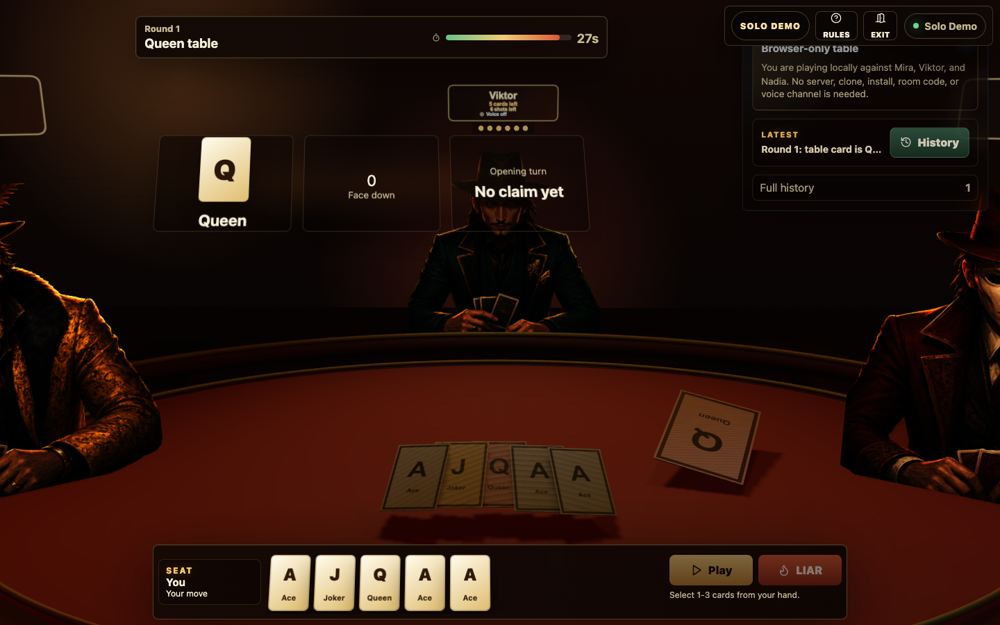

# Russian Roulette Liar's Deck

<p align="center">
  
</p>

An online multiplayer browser bluffing game. Players join a room, play hidden cards, call `LIAR`, and resolve a roulette-gun consequence when someone is caught bluffing or challenges incorrectly.

This project was built just for fun

## Play In Browser

- **Solo bot demo:** [Play Solo Demo](play/?autostart=1). The repository includes a static solo-only build that can auto-start for dashboard checks.
- **Multiplayer:** Real player rooms still require the Node/Socket.IO server because hidden cards, turns, timers, reconnect, and voice signaling are authoritative on the backend.

## What It Is

- **Players:** 2-4 real players online, or 1 player vs 3 local bots in the static solo demo.
- **Mode:** Online room-based multiplayer with a short room code, plus browser-only solo demo for GitLab Pages/GitDocs.
- **Core loop:** Play cards face down, bluff, challenge with `LIAR`, survive roulette.
- **Authority:** The Node/Socket.IO server owns cards, turns, timer, challenge outcomes, roulette results, eliminations, and winner detection.
- **Privacy:** Each player receives only their own hand. Opponents see hand counts, roulette shot counts, public table state, revealed challenge cards, and event log entries.
- **Presentation:** A phase-based React cockpit plus a cinematic Three.js table scene with 3D props, card motion, illustrated character rigs, a calm player-view camera, and roulette-gun suspense.
- **Voice:** Optional peer-to-peer WebRTC room voice. The server relays signaling only; audio streams stay between browsers.

## Screenshot



## How The Game Works

1. A host creates a room and shares the room code.
2. 1-3 other players join the same room.
3. The host starts once at least two players are seated.
4. Each round reveals a table rank: King, Queen, or Ace.
5. Each non-eliminated player receives hidden cards.
6. On your turn, play 1-3 cards face down, or call `LIAR` if there is a previous play.
7. A challenge reveals the previous played cards.
8. Wrong-rank cards are lies. Matching rank cards and Jokers are safe.
9. If the accused lied, the accused resolves roulette. If the accused was honest, the caller resolves roulette.
10. Each player has six roulette chambers: five dry and one hit, drawn without replacement.
11. A dry click means the player survives and the next round starts.
12. A hit eliminates the player.
13. If a player has already survived five dry shots, the sixth shot is guaranteed to hit.
14. After roulette resolves, the next round starts with the next non-eliminated player clockwise after the roulette player.
15. The last non-eliminated player wins.

## What You Control

- **Play Solo Demo:** Starts a local browser-only game against Mira, Viktor, and Nadia. No server or room code is needed. Bots have different bluffing styles, speak above their seats, and slow down after you are eliminated so the table remains watchable.
- **Create / Join mode:** Use the entry cockpit switch to host a new table or join with a room code.
- **Rules:** Open the rules overlay from the top room bar.
- **3D seat labels:** Read player name, voice state, and roulette chamber status above each character during play.
- **Voice dock:** Join voice, mute/unmute, test speakers, and inspect peer audio diagnostics.
- **History:** The latest event stays visible; the full event history opens from the History button.
- **Start / Play again:** Host-only controls to begin the first game or restart after the winner is shown.
- **Cards:** Select up to 3 cards from the bottom action tray.
- **Play:** Submit selected cards face down from the bottom action tray.
- **LIAR:** Challenge the previous play from the bottom action tray.
- **Voice:** Join room voice, leave voice, mute/unmute.
- **Exit / Leave room:** Exit the current room and clear the local reconnect session.

## What To Watch

- **Table rank:** The rank everyone is pretending to play this round.
- **Your hand:** Only you can see your card ranks.
- **Face-down pile:** Public count of cards played this round.
- **Previous play:** Shows who played last and how many cards they claimed.
- **Chamber dots:** Each seat shows six dots. Spent chambers dim, remaining chambers glow, and the final known chamber warns as **Last chamber**.
- **Turn timer:** The server auto-advances timed-out turns.
- **Clockwise order:** Seats move in join order around the table, skipping eliminated or empty-hand players when needed.
- **Forced challenge:** If only one player still has cards, they must call `LIAR`.
- **Challenge panel:** Reveals cards and shows the roulette result briefly after the animation resolves.
- **Resolution lock:** During the LIAR gun/result beat, cards and LIAR controls are locked for everyone until the server lock expires and the panel settles.
- **Cinematic focus:** Normal HUD panels recede during LIAR, roulette, and winner beats so the table scene is easier to read. The solo demo keeps the camera calm and waits for challenge resolution before bots or the player can continue.
- **Event log:** Public game history, with roulette/winner spoilers hidden until the cinematic reveal.
- **Voice indicators:** Shows who is in voice, muted, speaking, speaker-linked, receiving audio, blocked, or silent.

## Winning And Losing

- You lose when roulette resolves as a hit against you.
- You survive when roulette resolves as a dry click.
- Eliminated players remain visible but dimmed.
- The winner is the last player who has not been eliminated.
- Roulette result text is intentionally hidden until the gun animation reaches the result beat.
- After the winner is revealed, the host can click **Play again** to restart with the same room, and any player can click **Exit** to leave.

## Local Setup

```bash
npm install
```

For browser e2e tests, install Playwright's Chromium binary once:

```bash
npx playwright install chromium
```

## Run Locally

```bash
npm run dev
```

Open:

```text
http://localhost:5173/
```

The API/game server runs on:

```text
http://127.0.0.1:3001/
```

To test multiplayer on one machine, open two browser windows or two browser profiles. Create a room in one window, copy the room code, and join from the other.

## Play On The Same Wi-Fi / LAN

LAN play works when the server and Vite client bind to the network interface instead of only localhost.

1. Find the host machine's LAN IP, for example `192.168.1.50`.

2. Start the server:

```bash
HOST=0.0.0.0 CLIENT_ORIGIN=http://192.168.1.50:5173 npm run dev:server
```

3. Start the client in another terminal:

```bash
VITE_SERVER_URL=http://192.168.1.50:3001 npm run dev:client -- --host 0.0.0.0
```

4. Other players on the same Wi-Fi open:

```text
http://192.168.1.50:5173/
```

Notes:

- Your firewall may ask to allow incoming Node/Vite connections.
- Game multiplayer works over LAN HTTP.
- Browser microphone permissions are stricter; voice is most reliable on `localhost` or HTTPS.

## Private Online Deployment

The app can run as one Node server after a production build. Express serves the client bundle and Socket.IO serves multiplayer traffic on the same origin.

```bash
npm run build
NODE_ENV=production HOST=0.0.0.0 PORT=3001 CLIENT_ORIGIN=https://your-game.example.com npm start
```

For production voice chat, use HTTPS and configure STUN/TURN with `VITE_RTC_ICE_SERVERS` before building the client. Rooms are in memory, so a server restart closes active games.

See [Deployment Checklist](docs/DEPLOYMENT.md).

## Static Solo Demo

The static build is playable directly from the README and runs solo against bots. It does not need a Node server:

[Play Solo Demo](play/?autostart=1)

To build the static artifact locally:

```bash
npm run build:pages
```

The static build uses the same client bundle with a relative, static-hosting-safe base path.

The static demo disables room codes, WebRTC voice, and Socket.IO. It uses a local solo scheduler for bot turns, bot quotes, challenge pacing, and lightweight table sounds. The `?autostart=1` URL starts the bot demo immediately for hosted dashboard monitors; the in-game **Play** button also auto-plays one card in solo mode when no card is selected. For human-vs-human multiplayer, run the local/LAN/private Node server instructions above.

## Voice Chat

- Click **Join** in the Voice panel after entering a room.
- Grant microphone permission when the browser asks.
- Use **Mute / Unmute** during the game.
- Voice is peer-to-peer WebRTC.
- The server never receives audio streams.
- Socket.IO is used only for peer discovery, mute/speaking state, and WebRTC signaling.
- TURN credentials are not committed. Production deployments should provide ICE servers through `VITE_RTC_ICE_SERVERS`.
- The voice dock shows diagnostics for every remote peer: `Connecting audio`, `Speaker linked`, `Receiving audio`, `Audio blocked`, or `No voice detected`.
- Use **Test speaker** to confirm browser/OS output before debugging remote audio.

If you cannot hear another player:

- Make sure both players clicked **Join** in the Voice panel.
- Make sure the speaking player is not muted in the game or in the browser/OS.
- Check the Voice panel after joining. `0 speaker links` means the mic/signaling UI is connected, but no remote audio stream is attached yet.
- If the dock says `Audio blocked`, click **Click to enable audio**.
- If the dock says `Speaker linked` but never `Receiving audio`, the WebRTC stream is attached but the browser analyser is not seeing sound energy from that peer.
- Click anywhere in the game tab, use **Test speaker**, then leave and rejoin voice. Some browsers require a user gesture before audio output can start.
- Use two separate browser profiles or two separate devices for local testing; two tabs in one profile can make microphone testing confusing.
- Check browser site settings and allow microphone access for the app URL.
- For LAN HTTP testing, gameplay should work, but microphone/audio policies vary by browser. HTTPS is the reliable path for remote demos.
- For play across different networks, configure STUN/TURN through `VITE_RTC_ICE_SERVERS`.

## Development Commands

```bash
npm run dev          # server + client
npm run dev:server   # server only
npm run dev:client   # client only
npm run build        # production server/client build
npm start            # run built server
```

## Testing

```bash
npm run typecheck
npm test
npm run build
npm run test:e2e
npm run test:e2e:dry
npm run test:e2e:hit
npm run test:e2e:solo
npm run test:e2e:release
npm run release:check
```

What the tests cover:

- **Shared engine:** deck composition, dealing, legal/illegal plays, clockwise turn movement, LIAR outcomes, roulette, action locking, elimination, winner detection, forced calls, and redaction.
- **Client helpers:** roulette labels, suspense masking, timeline duration scaling, animation beat derivation, solo bot personality choices, solo scheduler gates, and table sound event mapping.
- **Socket integration:** create/join/start flow, private hand delivery, invalid payloads, reconnect token rotation, CORS behavior, voice peer discovery, mute broadcast, same-room signaling, and cross-room voice rejection.
- **Playwright e2e:** static solo demo without Socket.IO, two browser players, deterministic dry-miss continuation, deterministic hit/game-over/replay, 3-player browser survivor continuation, 4-player elimination continuation, 4-player accumulated pile spread, reconnect/refresh, rules overlay, mocked WebRTC voice controls, receiving-audio diagnostics, 3D nameplates, chamber indicators, hidden-card checks, card selection, suspense reveal gate, challenge panel auto-dismiss, scene asset readiness, redacted scene snapshots, and nonblank WebGL canvas.

Release checklist command:

```bash
npm run release:check
```

This runs typecheck, unit/integration tests, production build, the GitLab Pages solo build, and the full dry + hit + solo browser release matrix. Playwright reports are written under ignored `playwright-report/` and `test-results/` folders.

In restricted sandboxes, tests that bind local ports may need approval/escalation.

## Robustness Snapshot

Implemented:

- Authoritative server-side game engine.
- Per-player private hand state.
- Reconnect token expiry and rotation.
- Strict production `CLIENT_ORIGIN` CORS.
- Socket payload size cap.
- Payload validation for room codes, names, card IDs, reconnect tokens, and voice signals.
- Per-socket cooldowns for room, game, and voice actions.
- Global throttling for room create/join/reconnect attempts.
- Room cap, idle cleanup, and empty-room cleanup.
- Same-room checks for gameplay and voice signaling.
- Redacted scene snapshots with no private cards.

Known limits:

- No database or persistent rooms.
- No accounts, matchmaking, moderation, ban list, or leaderboard.
- No multi-server Socket.IO adapter.
- A server restart closes active rooms.
- Voice over the open internet needs HTTPS plus STUN/TURN.
- The cinematic client bundle is large; future production polish should lazy-load or split the Three.js scene.

## Assets

To regenerate the committed cinematic assets:

```bash
npm run generate:assets
```

An experimental Sketchfab `9 mm` importer remains available for local asset experiments:

```bash
npm run install:sketchfab-9mm -- /absolute/path/to/downloaded-file.glb
```

The release game uses the generated, committed original cinematic roulette prop at `toy-roulette.glb` by default. The optional Sketchfab file is not preferred by the runtime. See [Third-Party Assets](docs/THIRD_PARTY_ASSETS.md).

## Tech Stack

- TypeScript monorepo with npm workspaces.
- React + Vite client.
- Three.js cinematic scene.
- Node + Express + Socket.IO server.
- WebRTC peer-to-peer voice.
- Shared pure game engine package.
- Vitest unit/integration tests.
- Playwright browser e2e tests.

## Project Structure

```text
packages/
  shared/   Pure game rules, shared types, unit tests
  server/   Express + Socket.IO room server
  client/   React + Vite UI and Three.js scene
tests/e2e/  Playwright multiplayer smoke tests
docs/       Screenshots, deployment notes, third-party asset notes
scripts/    Cinematic GLB and texture asset generators
```

## Docs

- [SPEC.md](SPEC.md)
- [ARCHITECTURE.md](ARCHITECTURE.md)

## Repository Location

```text
dev/Russian-roulette
```
