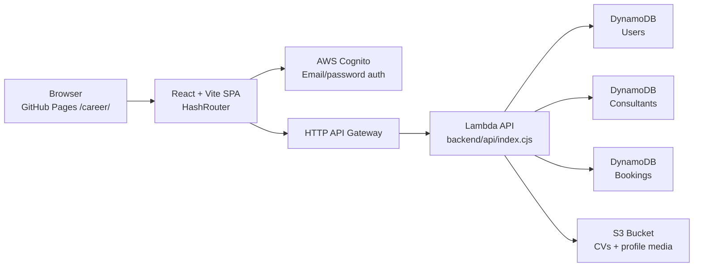

# CareerLane

CareerLane is a full-stack career platform for two main roles:

- users / professionals who want to build a profile, upload a CV, browse consultants, and request sessions
- consultants / mentors who want to publish a profile, upload profile media, manage availability, and receive booking requests

The project is intentionally split into three layers:

1. a static React + Vite frontend that is deployed under `/career/` on GitHub Pages
2. a serverless AWS backend made of API Gateway + Lambda + DynamoDB + S3
3. Terraform infrastructure that creates and wires the AWS resources

This README is meant to explain the whole architecture in a practical, step-by-step way, so someone opening the repository can understand how the system works end to end.

## 1. High-Level Architecture



At runtime:

- GitHub Pages serves the static frontend from `/career/index.html`
- the React app uses `HashRouter`, so navigation works on a static host without server-side route rewrites
- Cognito handles login, registration, confirmation, and password reset
- the frontend calls the AWS HTTP API with a JWT token for protected routes
- the Lambda reads and writes data in DynamoDB
- uploads go directly to S3 through pre-signed URLs generated by the Lambda

### 1.1 CloudFront Decision

CloudFront is not part of the current production path for one simple reason:

- the frontend is hosted on GitHub Pages, not on S3 or another AWS origin we control directly

For the current architecture, the better first optimizations are:

- cache-friendly responses for public API reads such as consultant list/profile pages
- API throttling at API Gateway
- optional Lambda concurrency caps to protect against unexpected spend

This keeps the stack cheaper and simpler while traffic is still small.

If the frontend later moves from GitHub Pages to AWS hosting, the future-ready path is:

1. move the static site to S3
2. place CloudFront in front of the static site
3. optionally put CloudFront in front of only the cacheable public API routes

That is the point where CloudFront becomes a clear win instead of extra cost and operational surface.

## 2. Repository Structure

```text
career/
├── index.html                  # built entry file for GitHub Pages
├── assets/                     # built frontend bundle for GitHub Pages
├── src/
│   ├── index.html              # Vite source HTML entry used for dev/build
│   ├── main.tsx                # React entry point
│   ├── styles/global.css       # global design system and layout rules
│   ├── lib/
│   │   ├── config.ts           # runtime env config
│   │   ├── auth.tsx            # Cognito auth provider
│   │   ├── api.ts              # frontend API client
│   │   ├── types.ts            # shared frontend data types
│   │   └── url.ts              # public/base-path URL helpers
│   └── app/
│       ├── App.tsx             # top-level app boot
│       ├── layout/AppShell.tsx # header, footer, route shell
│       ├── layout/PageScene.tsx# shared route-level visual wrapper
│       ├── pages/              # route wrappers for each public/private page
│       └── legacy/SiteAppLegacy.tsx
│                                # most page implementations currently live here
├── backend/
│   └── api/
│       ├── index.cjs           # Lambda handler and route logic
│       ├── package.json        # Lambda dependencies
│       └── node_modules/       # packaged by Terraform into the zip
├── infra/
│   └── terraform/
│       ├── main.tf             # AWS resources
│       ├── variables.tf        # Terraform inputs
│       ├── outputs.tf          # Terraform outputs used by the frontend
│       └── terraform.tfvars    # environment-specific values
├── scripts/
│   └── site-build.mjs          # converts Vite output into GitHub Pages root files
├── vite.config.ts              # Vite base path and build config
└── package.json                # frontend scripts
```

Important note:

- `index.html` and `assets/` at the repository root are deploy artifacts for GitHub Pages
- they are regenerated by `npm run build`
- the source HTML and app code live in `src/`
- do not treat the built `assets/` files as source files

## 3. Frontend Architecture

### 3.1 Boot Flow

The frontend starts in:

- `src/index.html`
- `src/main.tsx`

The source HTML loads `src/main.tsx`. `src/main.tsx` then:

1. imports the global CSS
2. mounts the React app into `#root`
3. renders the top-level `App`

`src/app/App.tsx` then wraps the app in:

- `HashRouter` from `react-router-dom`
- `AuthProvider` from `src/lib/auth.tsx`

This is important because:

- `HashRouter` keeps routing compatible with GitHub Pages static hosting
- `AuthProvider` makes the current Cognito user and JWT token available throughout the app

### 3.2 Routing Model

The visible site shell is controlled by:

- `src/app/layout/AppShell.tsx`

It is responsible for:

- header
- footer
- route switching
- route transition feedback
- page title updates
- scroll reset on navigation

Routes include:

- `/`
- `/users`
- `/consultants`
- `/consultants/:slug`
- `/auth`
- `/dashboard`
- `/about`
- `/faq`
- `/contact`
- `/legal`

Because this is a GitHub Pages deployment under `/career/`, the app uses:

- Vite base path: `/career/`
- `HashRouter`: routes look like `#/dashboard`, `#/consultants/some-slug`, etc.

This avoids 404s on refresh that would happen with a normal browser-history router on a static host.

### 3.3 Current UI Code Organization

The route files inside `src/app/pages/` are now real route wrappers. Each one:

- imports the corresponding page implementation from `src/app/legacy/SiteAppLegacy.tsx`
- wraps it in `src/app/layout/PageScene.tsx`
- assigns a route-specific tone such as `home`, `directory`, `consultant`, `auth`, or `dashboard`

This gives the app:

- a consistent page-level motion layer
- unified visual backgrounds and route rhythm
- cleaner future refactors, because page-level structure is no longer hidden inside a single giant file

Most of the actual page implementation still lives in:

- `src/app/legacy/SiteAppLegacy.tsx`

This means:

- the architecture is already separated into layout + route wrappers + page scene + page implementations
- the rendering logic is still centralized in one larger file
- future refactors can gradually move page logic out of `SiteAppLegacy.tsx` into smaller files without changing the deployment model

## 4. Frontend Runtime Configuration

The frontend reads environment values from:

- `src/lib/config.ts`

These values come from Vite env variables:

- `VITE_APP_NAME`
- `VITE_AWS_REGION`
- `VITE_API_BASE_URL`
- `VITE_COGNITO_USER_POOL_ID`
- `VITE_COGNITO_USER_POOL_CLIENT_ID`
- `VITE_BASE_PATH`

Two important booleans are derived there:

- `isApiConfigured`
- `isCognitoConfigured`

If the API or Cognito values are missing, the app can detect that and fail in a controlled way instead of pretending the backend exists.

## 5. Authentication Architecture

Authentication is implemented in:

- `src/lib/auth.tsx`

It uses:

- `aws-amplify`
- `aws-amplify/auth`

The provider exposes:

- `register`
- `confirm`
- `login`
- `requestPasswordReset`
- `completePasswordReset`
- `logout`
- `user`
- `token`
- `loading`

### 5.1 Auth Step by Step

#### Restore existing session

When the app loads:

1. `AuthProvider` checks whether Cognito is configured
2. if yes, it calls `getCurrentUser()` and `fetchAuthSession()`
3. if a session exists, it stores:
   - the signed-in user
   - the Cognito ID token
4. if no session exists, it leaves the app in a signed-out state

#### Register flow

1. the user fills the register form on `/auth`
2. the frontend calls `signUp(...)`
3. Cognito creates the account
4. the app moves the user into confirmation
5. after email confirmation, the user can log in

#### Confirm flow

1. the user enters the confirmation code
2. the frontend calls `confirmSignUp(...)`
3. Cognito marks the account as confirmed

#### Login flow

1. the user enters email and password
2. the frontend calls `signIn(...)`
3. it then calls `fetchAuthSession()`
4. the ID token is stored in the auth context
5. all protected API requests can now send `Authorization: Bearer <token>`

#### Password reset flow

1. the user requests a reset code via email
2. the frontend calls `resetPassword(...)`
3. the user submits the received code and a new password
4. the frontend calls `confirmResetPassword(...)`

## 6. Frontend API Client

The frontend API client lives in:

- `src/lib/api.ts`

All backend calls go through the shared `request<T>()` helper.

That helper:

1. checks that the API is configured
2. attaches `Content-Type: application/json` when appropriate
3. attaches the JWT token when provided
4. calls `fetch`
5. throws a readable error when the backend returns a non-OK response

### 6.1 Public API Calls

These do not require a token:

- `GET /consultants`
- `GET /consultants/{slug}`

Used for:

- public directory
- home page spotlight / top profiles
- consultant detail page

### 6.2 Protected API Calls

These require the JWT token:

- `POST /auth/bootstrap`
- `GET /me/profile`
- `PUT /me/profile`
- `GET /consultants/me`
- `PUT /consultants/me`
- `POST /me/cv/upload-url`
- `GET /bookings`
- `POST /bookings`

Used for:

- creating the application-level profile after Cognito auth
- editing user profile
- editing consultant profile
- requesting upload URLs
- listing and creating bookings

## 7. Backend Architecture

The backend is a single Lambda handler:

- `backend/api/index.cjs`

It is a small HTTP API server implemented manually inside one file.

### 7.1 Backend Responsibilities

The Lambda does all of the following:

- reads JWT claims from API Gateway
- loads users from DynamoDB
- creates or updates user profiles
- creates or updates consultant profiles
- lists public consultants
- loads a consultant by slug
- creates pre-signed S3 upload URLs
- lists bookings
- creates bookings
- signs S3 object URLs for private media/documents before returning them to the frontend

### 7.2 Route Map

| Method | Path | Auth | Purpose |
| --- | --- | --- | --- |
| `GET` | `/health` | No | health check |
| `GET` | `/consultants` | No | public consultant list |
| `GET` | `/consultants/{slug}` | No | public consultant detail |
| `GET` | `/consultants/me` | Yes | consultant's own editable profile |
| `PUT` | `/consultants/me` | Yes | create/update consultant profile |
| `POST` | `/auth/bootstrap` | Yes | create the app-level user record after Cognito login |
| `GET` | `/me/profile` | Yes | get user profile |
| `PUT` | `/me/profile` | Yes | update user profile |
| `POST` | `/me/cv/upload-url` | Yes | request pre-signed upload URL for CV/avatar/hero media |
| `GET` | `/bookings` | Yes | list bookings for current user or consultant |
| `POST` | `/bookings` | Yes | create booking request |

### 7.3 Lambda Request Handling Step by Step

Every request follows the same pattern:

1. API Gateway sends the HTTP request to Lambda in payload format `2.0`
2. Lambda reads:
   - method
   - `rawPath`
   - JWT claims from `requestContext.authorizer.jwt.claims`
3. Lambda matches the route in `exports.handler`
4. the handler function runs business logic
5. the response helper adds JSON headers and CORS headers
6. the frontend receives JSON

## 8. Data Model

There are three DynamoDB tables.

### 8.1 Users Table

Hash key:

- `userId`

Stores data such as:

- `email`
- `name`
- `role`
- `plan`
- `avatarUrl`
- `avatarStorageKey`
- `city`
- `occupation`
- `age`
- `headline`
- `bio`
- `experienceSummary`
- `experienceHighlights`
- `educationHighlights`
- `skills`
- `interests`
- `keywords`
- `goals`
- `preferredSessionModes`
- `cvDocument`

### 8.2 Consultants Table

Hash key:

- `consultantId`

GSIs:

- `slug-index`
- `owner-index`

Stores data such as:

- `ownerUserId`
- `profileType`
- `theme`
- `slug`
- `name`
- `headline`
- `bio`
- `experienceSummary`
- `experienceHighlights`
- `educationHighlights`
- `city`
- `languages`
- `specializations`
- `sessionModes`
- `tags`
- `idealFor`
- `consultationTopics`
- `workApproach`
- `sessionLengthMinutes`
- `availability`
- `nextAvailable`
- `avatarUrl`
- `heroUrl`
- `avatarStorageKey`
- `heroStorageKey`
- `isPublic`
- `profileStatus`
- `subscriptionStatus`
- `membershipTier`

### 8.3 Bookings Table

Hash key:

- `bookingId`

GSIs:

- `client-index`
- `consultant-index`

Stores data such as:

- `consultantId`
- `consultantName`
- `clientId`
- `scheduledAt`
- `status`
- `note`
- `createdAt`

## 9. Step-by-Step Business Flows

### 9.1 New User Registration to Working Dashboard

1. visitor opens `/auth`
2. visitor registers through Cognito
3. visitor confirms the code sent by email
4. visitor logs in
5. the frontend receives the JWT token
6. the app calls `POST /auth/bootstrap`
7. the backend creates the user record in the `users` table
8. if the role is consultant, the backend also creates a consultant draft in the `consultants` table
9. the user is redirected to `/dashboard`
10. the dashboard loads:
    - `GET /me/profile`
    - `GET /bookings`
    - `GET /consultants/me` for consultants
    - `GET /consultants` for matching/public discovery

### 9.2 User Profile Editing

1. the user opens the dashboard
2. the frontend fills the form from `GET /me/profile`
3. when the user saves the form, the frontend sends `PUT /me/profile`
4. the Lambda merges changes with the current record
5. the updated record is written back to DynamoDB
6. the Lambda returns the normalized profile
7. the frontend updates the screen with the saved result

### 9.3 User Avatar Upload

1. the user chooses an avatar file
2. the frontend calls `POST /me/cv/upload-url` with `kind: "user-avatar"`
3. the Lambda returns:
   - a pre-signed `uploadUrl`
   - the future `storageKey`
4. the browser uploads the file directly to S3 using `PUT`
5. after the upload succeeds, the frontend calls `PUT /me/profile` with the `avatarStorageKey`
6. later, when the profile is loaded, the backend signs the object and returns a temporary `avatarUrl`

### 9.4 CV Upload

1. the user selects a CV file
2. the frontend requests a signed URL through `POST /me/cv/upload-url`
3. the browser uploads the file directly to S3
4. the frontend saves the returned `document` metadata into the user profile via `PUT /me/profile`
5. the user dashboard then shows the saved CV document info

### 9.5 Consultant Profile Creation

1. a consultant logs in
2. `POST /auth/bootstrap` ensures a user profile exists
3. if no consultant row exists yet, the backend creates a draft consultant profile
4. the consultant edits the public profile in the dashboard
5. the frontend sends `PUT /consultants/me`
6. the backend:
   - confirms the current user is a consultant
   - checks slug uniqueness when changed
   - merges the new data into the draft
   - calculates `nextAvailable`
   - stores the final row in the consultants table
7. the public profile becomes available through:
   - `GET /consultants`
   - `GET /consultants/{slug}`

### 9.6 Consultant Profile Media

Consultant and mentor profiles use only two image slots:

- profile picture: saved through `avatarUrl` / `avatarStorageKey` and used everywhere the profile appears
- optional top banner: saved through `heroUrl` / `heroStorageKey` and shown only when present

If the consultant does not add a top banner, the public profile hides the banner area instead of showing an empty placeholder.

Upload flow:

1. the consultant selects a profile picture or optional top banner image
2. the frontend requests a signed URL via `POST /me/cv/upload-url`
3. the request includes `kind: "avatar"` or `kind: "hero"`
4. the browser uploads the file directly to S3
5. the frontend saves the returned `avatarStorageKey` / `heroStorageKey` through `PUT /consultants/me`
6. on subsequent reads, the backend returns signed media URLs

### 9.7 Demo Profiles and Paid Profile Themes

The local fallback catalogue in `src/lib/demo-data.ts` includes seeded demo consultants and demo users so the public pages feel populated before production data is ready.

- Fake demo profiles are intentionally named as My Little Pony / Powerpuff Girls inspired demo entries, so they are easy to identify and remove later.
- The demo images use generic generated avatars or neutral placeholder photography, not copyrighted character artwork.
- Consultant profiles can include an optional `theme` field.
- Supported theme values are `violet`, `sky`, `rose`, `mint`, and `amber`.
- The current UI can render themed consultant cards, hero profiles, spotlight rows, and public profile pages through color treatment only; public cards do not show paid-feature copy.
- The backend only persists a consultant `theme` when the consultant's account plan is `pro`; free saved profiles are normalized back to the standard theme.
- Theme editing/gating still needs the paid-plan control flow before real users can choose themes in production.

### 9.7 Public Consultant Browsing

1. the public frontend calls `GET /consultants`
2. the backend scans the consultants table
3. it filters out non-public profiles
4. it optionally filters by:
   - query
   - city
5. it sorts results by:
   - featured first
   - review count
   - rating
   - name
6. it decorates media and normalizes arrays before returning JSON

### 9.8 Booking Flow

1. a logged-in user opens a consultant page
2. the frontend shows public consultant details and availability
3. the user selects a slot
4. the frontend calls `POST /bookings`
5. the backend validates:
   - user exists
   - role is `client`
   - consultant exists
   - consultant profile is public
   - the user is not booking their own profile
6. the backend writes a booking row to DynamoDB
7. the dashboard loads bookings via `GET /bookings`
8. consultants see bookings via the `consultant-index`
9. clients see bookings via the `client-index`

## 10. S3 Upload Model

CareerLane does not upload large files through the Lambda directly.

Instead:

1. frontend asks Lambda for a signed upload URL
2. Lambda generates a short-lived S3 `PUT` URL
3. browser uploads directly to S3
4. frontend stores the resulting metadata/storage key in DynamoDB
5. backend later signs `GET` URLs when data is read back

Why this matters:

- Lambda stays small and simple
- uploads are faster
- the S3 bucket can remain private
- the frontend never needs AWS credentials

## 11. Terraform Infrastructure

The infrastructure is defined in:

- `infra/terraform/main.tf`

### 11.1 What Terraform Creates

Terraform provisions:

- Cognito user pool
- Cognito app client
- S3 bucket for CVs and profile media
- S3 public access block
- S3 CORS configuration
- DynamoDB users table
- DynamoDB consultants table with `slug-index` and `owner-index`
- DynamoDB bookings table with `client-index` and `consultant-index`
- Lambda IAM role
- Lambda IAM policy for logs, DynamoDB, and S3
- Lambda function
- API Gateway HTTP API
- API Gateway JWT authorizer backed by Cognito
- public and protected API routes
- `$default` stage with auto deploy
- API throttling defaults on the `$default` stage
- Lambda permission for API Gateway invoke

### 11.2 Terraform to Runtime Wiring

Terraform passes these environment variables into the Lambda:

- `USERS_TABLE`
- `CONSULTANTS_TABLE`
- `BOOKINGS_TABLE`
- `CV_BUCKET`
- `ALLOWED_ORIGIN`

That is how the Lambda knows:

- which tables to read/write
- which S3 bucket to use
- which frontend origin should be allowed by CORS

### 11.3 Cognito Note

The user pool resource includes:

- `lifecycle { ignore_changes = [schema] }`

This is important because AWS Cognito does not allow arbitrary schema mutations after a pool has been created. Without this guard, later `terraform apply` runs can fail even when the rest of the infrastructure changes are valid.

### 11.4 Cost and Performance Guardrails

The current Terraform stack is tuned for a small production rollout:

- DynamoDB uses `PAY_PER_REQUEST`, which avoids paying for provisioned capacity while traffic is low
- Lambda runs on `arm64`, which is generally cheaper than x86 for the same workload
- the S3 upload bucket uses direct browser uploads through pre-signed URLs, so Lambda does not spend time proxying file data
- API Gateway applies default throttling to protect the backend from accidental spikes
- Lambda can optionally use `lambda_reserved_concurrency` to put a hard ceiling on backend cost

The backend also sends cache headers for:

- `GET /consultants`
- `GET /consultants/{slug}`

This helps browsers and any future CDN layer reuse public consultant data instead of hitting Lambda on every request.

## 12. Build Architecture

The frontend build is intentionally customized for GitHub Pages.

The relevant files are:

- `package.json`
- `vite.config.ts`
- `scripts/site-build.mjs`

### 12.1 Why a Custom Build Script Exists

The site is served from:

- `/career/index.html`

and the built assets must land directly in:

- `/career/assets`

GitHub Pages serves the repository content as static files, so the build process must finish by copying the final output to the repository root.

### 12.2 Frontend Build Step by Step

When you run `npm run build`:

1. `tsc --noEmit` type-checks the frontend
2. Vite reads the source HTML from `src/index.html`
3. Vite builds the app into `dist/`
4. `scripts/site-build.mjs` deletes the old root `assets/`
5. it copies `dist/assets/` into root `assets/`
6. it copies `dist/index.html` into root `index.html`
7. it copies static public files such as `manifest.json`, `sw.js`, icons, and OG image into the `career/` root
8. it deletes `dist/` again

Result:

- `career/index.html` points to built `/career/assets/...` files and can be served by GitHub Pages

### 12.3 Dev Mode Step by Step

When you run `npm run dev`:

1. Vite reads `src/index.html`
2. Vite starts the local dev server
3. the app runs with hot reload against source files in `src/`
4. the root deploy artifact `career/index.html` is not rewritten

The dev entry also unregisters the `/career/` service worker and clears
`careerlane-*` caches. This prevents a previously built GitHub Pages service
worker from serving stale cached HTML while Vite is running locally.

## 13. Environment Variables

The key frontend variables are:

| Variable | Purpose |
| --- | --- |
| `VITE_APP_NAME` | visible app name |
| `VITE_AWS_REGION` | AWS region |
| `VITE_API_BASE_URL` | HTTP API endpoint |
| `VITE_COGNITO_USER_POOL_ID` | Cognito user pool id |
| `VITE_COGNITO_USER_POOL_CLIENT_ID` | Cognito app client id |
| `VITE_COGNITO_DOMAIN` | Cognito Hosted UI domain for social login |
| `VITE_COGNITO_SOCIAL_PROVIDERS` | enabled social providers list |
| `VITE_BASE_PATH` | base path for GitHub Pages, currently `/career/` |

Terraform exports these through:

- `infra/terraform/outputs.tf`

Specifically the `frontend_env_snippet` output is meant to be copied into `.env.production`.

## 14. Local Development Commands

### Frontend

```bash
npm install
npm run dev
```

Open the local site at:

```bash
http://127.0.0.1:5173/career/
```

### Frontend production build

```bash
npm run build
```

### Backend dependencies

```bash
cd backend/api
npm install
```

### Terraform

```bash
cd infra/terraform
terraform init
terraform apply
```

## 15. Recommended Deployment Flow

### Full deploy flow

1. update backend or infrastructure code as needed
2. run `terraform apply` in `infra/terraform`
3. copy the new `frontend_env_snippet` values into `.env.production` if outputs changed
4. run `npm run build`
5. confirm the root `index.html` and `assets/` changed as expected
6. commit and push the repository
7. GitHub Pages serves the updated static app from `/career/`

### Frontend-only deploy flow

If only UI code changed and AWS outputs did not change:

1. run `npm run build`
2. confirm `career/index.html` does not reference `/src/main.tsx`
3. commit `index.html`, `assets/`, and source changes
4. push to the GitHub Pages branch / source branch

### Backend-only deploy flow

If only Lambda / infrastructure changed:

1. update backend code in `backend/api`
2. run `terraform apply`
3. no frontend rebuild is required unless outputs or UI behavior changed

## 16. Validation Commands

Useful sanity checks:

```bash
npm run build
node -c backend/api/index.cjs
cd infra/terraform && terraform validate
```

For a fuller production sanity pass, use this order:

1. `npm run build`
2. `node -c backend/api/index.cjs`
3. `cd infra/terraform && terraform validate`
4. review that root `index.html` and `assets/` were regenerated
5. if backend or Terraform changed, run `terraform apply`

## 17. Known Limitations / Current Product Notes

These are important to know when working on the project:

- Cognito email/password auth is wired and active
- Google / Apple / LinkedIn buttons are not fully wired until Cognito social identity providers are configured
- the payment / subscription model is presented in the UI, but paid billing is not yet fully wired into a real payments backend
- most of the UI implementation still lives in `src/app/legacy/SiteAppLegacy.tsx`
- route-level structure now lives in `src/app/pages/` and `src/app/layout/PageScene.tsx`, but detailed page logic is still being extracted gradually from the legacy file
- the public site is static, so route handling depends on `HashRouter`
- the root `career/index.html` is generated during build and must be committed as a deploy artifact while GitHub Pages serves the repository directly

## 18. Mental Model for Future Work

If you need to reason about the system quickly, use this model:

1. Cognito proves identity
2. `/auth/bootstrap` creates the app-level user record
3. `/me/profile` stores the user-facing profile
4. `/consultants/me` stores the public consultant profile
5. S3 stores uploaded files, but only through pre-signed URLs
6. DynamoDB stores the canonical data
7. GitHub Pages serves the frontend
8. Terraform is the source of truth for AWS infrastructure

That is the core architecture of CareerLane.
